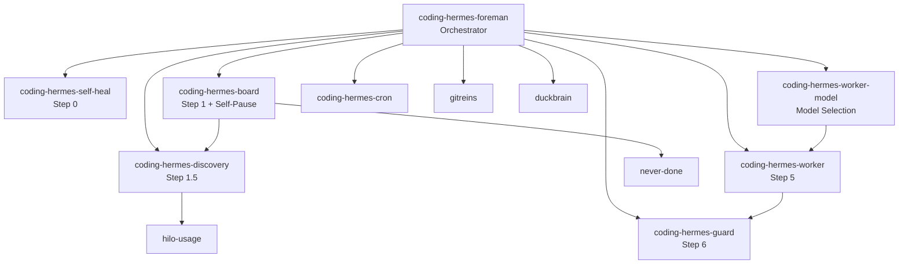

> See [coding-hermes-map] for the full skill hierarchy and when to use each skill.

# Coding Hermes Foreman — Full SDLC Project Delivery

The foreman is the per-project orchestrator. Every tick runs a complete software development lifecycle: self-heal, scan the board, analyze impact, load project memory, pre-load context, spawn a worker with the right model and provider, verify quality through GitReins guard and judge, commit, submit learnings to Off-by-One, write findings to DuckBrain, and scan external signals before the next task. The foreman DOES NOT write code — it inspects, plans, dispatches, and verifies.

**A foreman tick delivers a complete unit of work.** Not a fragment. Not a step. The worker writes code until the acceptance criteria are met, the guard passes, the judge approves, and the commit is clean. If the worker fails, the foreman retries with adjustments. If the worker succeeds, the foreman learns and moves on.


```mermaid
graph TD
    CF[coding-hermes-foreman<br/>Orchestrator]
    SH[coding-hermes-self-heal<br/>Step 0]
    BD[coding-hermes-board<br/>Step 1 + Self-Pause]
    DS[coding-hermes-discovery<br/>Step 1.5]
    WM[coding-hermes-worker-model<br/>Model Selection]
    WK[coding-hermes-worker<br/>Step 5]
    GD[coding-hermes-guard<br/>Step 6]
    CR[coding-hermes-cron]
    HI[hilo-usage]
    GR[gitreins]
    DB[duckbrain]
    ND[never-done]

    CF --> SH
    CF --> BD
    CF --> DS
    CF --> WM
    CF --> WK
    CF --> GD
    BD --> DS
    BD --> ND
    WM --> WK
    WK --> GD
    DS --> HI
    CF --> CR
    CF --> GR
    CF --> DB
```

## Critical: Foreman Does NOT Use delegate_task

The foreman spawns workers via `hermes chat` CLI, not `delegate_task`. Delegation inherits the foreman's model and provider (PAYG deepseek-foreman), which is exactly wrong. Workers must use prepaid flat-rate buckets. The foreman selects the worker's model and provider independently per task.

```bash
# CORRECT — independent session, separate model/provider
# Use cd for workdir (hermes chat has no --workdir flag)
# Use terminal(background=true) for async (hermes chat has no --background flag)
cd ~/<project> && hermes chat -q '<compiled prompt>' -m '<coding-model>' --provider '<prepaid-bucket>' --ignore-rules --cli -Q
```

```python
# WRONG — inherits foreman's PAYG provider
delegate_task(goal="...", context="...", role="leaf")
```

## The Full Foreman Loop

```
┌─────────────────────────────────────────────────────────────────────┐
│ TICK FIRES                                                          │
│   ↓                                                                 │
│ 0. SELF-HEAL — identity, deps, CI, transient fixes                  │
│   ↓                                                                 │
│ 1. READ BOARD — .coding-hermes/board/tasks.jsonl (JSONL canonical store;     │
│    board.db/parquet = untracked caches; doctrine: references/               │
│    board-storage-canonical.md), count pending                               │
│   ├── Board has tasks? → PICK TASK → continue to Step 2             │
│   └── Board empty? → 1.5 DISCOVERY SWEEP → 1.5h E2E VERIFY          │
│        ├── Sweep found work? → create tasks → 1.6 → NEXT            │
│        └── No work + E2E passes? → SELF-PAUSE TRACK → 1.6 → NEXT    │
│   ↓                                                                 │
│ 2. HILO IMPACT — graph, impact analysis, classify                   │
│   ↓                                                                 │
│ 3. DUCKBRAIN RECALL — load past decisions, pitfalls, patterns       │
│   ↓                                                                 │
│ 4. PRE-LOAD — assemble context + compile through prompt-foundry     │
│   ↓                                                                 │
│ 5. SPAWN WORKER — hermes chat -q, coding model, prepaid bucket      │
│   ↓                                                                 │
│ 6. GITREINS GUARD — tier 1: secrets, build, lint, tests             │
│   ↓                                                                 │
│ 7. GITREINS JUDGE — tier 2: LLM evaluation vs acceptance criteria   │
│   ↓                                                                 │
│ 8. COMMIT — targeted add, correct authorship, descriptive message   │
│   ↓                                                                 │
│ 9. OFF-BY-ONE — submit solved problem, discover cached solutions    │
│   ↓                                                                 │
│ 10. DUCKBRAIN WRITE — store findings, patterns, pitfalls, idle ctr  │
│   ↓                                                                 │
│ 1.6 SCAN SIGNALS — external changes, CI status, new issues, deps    │
│   ↓                                                                 │
│ ➡️ SELF-PAUSE CHECK — idle ticks? adjust interval or pause          │
│ ➡️ NEXT TASK — return to Step 1                                     │
└─────────────────────────────────────────────────────────────────────┘
```

## Step 0 — Self-Heal
Load skill: coding-hermes-self-heal
See [coding-hermes-self-heal] for full self-heal procedure.

## Step 1 — Read Board
Load skill: coding-hermes-board
See [coding-hermes-board] for full board + self-pause procedure.

## Step 1.5 — Discovery Sweep
Load skill: coding-hermes-discovery
See [coding-hermes-discovery] for full discovery sweep across all languages.

## Self-Pause — Only NEVER-DONE Remains
Load skill: coding-hermes-board
See [coding-hermes-board] for self-pause procedure.

## Step 2 — Hilo Impact Analysis

**Daemon pitfalls reference:** See `references/daemon-pitfalls.md` for: autoSlowdown fighting manual cooldowns, Deliver field persistence bug, cooldown reversion on crash, background review trap, and model sweep filtering bugs.

Before touching code, understand the blast radius. Hilo prevents "fix one thing, break three others."

```bash
hilo graph <project>           # spatial map of the codebase
hilo impact <file-or-function>  # what depends on this?
hilo classify "<task>"          # categorize the task type
```

**What you learn:**
- Which files the task touches directly
- Which other files depend on those files (transitive impact)
- Whether this is a refactor, feature, bug fix, or infrastructure change

**Use this to inform the worker.** Don't just pass a task description — pass the impact analysis. "Modify parser.go — depends_on: lexer.go, ast.go, formatter.go. Risk: high, 3 dependent packages."

## Step 3 — DuckBrain Context Load

Load YOUR OWN memory before action. You have been here before. Don't rediscover what you already know.

**First — load YOUR state (what you decided, what you understand):**
```python
# What do I already know about this project?
duckbrain_recall(key="/project/<name>/status", namespace="<project-namespace>")
duckbrain_list_keys(prefix="/project/<name>/", namespace="<project-namespace>")
duckbrain_recall(query="architecture understanding components", namespace="<project-namespace>")
duckbrain_recall(query="model choices which model best for what", namespace="<project-namespace>")
```

**Then — load task-specific context for the worker:**
```python
duckbrain_recall(query="architecture decisions <subsystem>", namespace="<project-namespace>")
duckbrain_recall(query="pitfalls <subsystem>", namespace="<project-namespace>")
duckbrain_recall(query="patterns <task-type>", namespace="<project-namespace>")
```

**WHY this matters:** Without loading your own state, you walk into a project blind every tick. You don't know what architecture decisions were made, which models worked, what's already built. You spend tokens rediscovering. With DuckBrain, you walk in with memory — you know the project like you never left.

**⚠️ CRITICAL: NEVER call `switch_namespace`. ALWAYS pass `namespace` explicitly.** `switch_namespace` changes the global default namespace in `duckbrain.config.json`, which affects EVERY other foreman and agent using DuckBrain. This is the root cause of the DB-003 write degradation bug — 20 foremen switching the default 20 times a day made writes and reads target different namespaces. See `references/duckbrain-namespace-split-brain.md`.

**⚠️ DuckBrain namespaces can be design notes for EXISTING projects, not new ones.** See `references/duckbrain-namespace-cross-reference.md` — cross-reference before creating anything from a namespace.

```python
# Load decisions, pitfalls, patterns, and status for this task
# ALWAYS pass namespace=<project-namespace> explicitly
duckbrain_recall(query="architecture decisions <subsystem>", domain="event", namespace="<project-namespace>")
duckbrain_recall(query="pitfalls <subsystem>", domain="concept", namespace="<project-namespace>")
duckbrain_recall(query="patterns <task-type>", domain="concept", namespace="<project-namespace>")
duckbrain_recall(key="/project/<name>/status", domain="config", namespace="<project-namespace>")
```

**Format for the worker:** Summarize, don't dump raw output. "Last time we touched the parser, we broke the lexer because of a token ordering assumption. Use the TokenStream interface, not raw tokens."

**Semantic search fallback:** when `recall()` returns `"requires embedding model"`, a BigInt serialization error (`"Do not know how to serialize a BigInt"`), or any transport-level failure, fall back to `list_keys(prefix="/project/<name>/")`. If empty (no keys), skip to Step 4. Don't burn time retrying — all three failures are DuckBrain MCP transport issues that won't resolve on retry. Proven: <project> 2026-07-16.
```python
# List what keys exist under the project namespace
duckbrain_list_keys(prefix="/project/<name>/", maxDepth=3)
```
If the namespace is empty (no keys, no prefixes), this is a fresh project — skip to Step 4 with no context. Don't burn time retrying semantic recall.

## Step 4 — Pre-Load

Assemble the complete context package for the worker. This is the foreman's core value-add — synthesizing information into a clear, executable task.

**The worker prompt must include:**

1. **Task description** — from the board, verbatim across the `## [ ]` header and `- [ ]` subtasks
2. **Hilo impact analysis** — what depends on this code, blast radius, risk level
3. **DuckBrain context** — summarized past decisions, pitfalls, patterns
4. **Relevant files** — read the actual code the worker will modify (don't send filenames, send content)
5. **Acceptance criteria** — from the task board. Concrete, verifiable, measurable
6. **Verification requirements** — the worker MUST run ad-hoc verification scripts after every edit. No verbal claims accepted.
7. **Commit instructions** — targeted add only, correct authorship, descriptive message
8. **GitReins instructions** — the worker MUST run `gitreins guard` before committing and handle failures

**Compile through prompt-foundry** to produce a clean, well-structured worker prompt. The prompt-foundry skill knows how to format for different model types (GLM needs structured format, MiniMax needs different structure).

**The worker gets ONE message — no skills, no architecture, no fleet context, no model/provider awareness.** The foreman handles all of that. The worker just codes.

### Non-Code Tasks — When the Foreman IS the Worker

Investigation, health-check, monitoring, root-cause analysis, and operational CLI-execution tasks skip Steps 5-7. See `references/operational-cli-batch-tasks.md` for the CLI execution variant.

```
Step 0 → Step 1 → Step 2 (skip if no code) → Step 3 → Step 4 (investigation plan, not worker prompt)
    → SKIP Steps 5-7 → Step 8 (commit findings/board update) → Step 9 → Step 10 → Step 1.6
```

**When to use the shortened loop:**
- Infrastructure investigation (write degradation, thread leak analysis, health checks)
- Server-side diagnostics (MCP health, connection state, error log review)
- Monitoring transitions (moving a task from "likely resolved" to "48h watch")
- Tasks marked `## [ ] INFRA` or `## [ ] INVESTIGATE` on the board

**What changes:**
- Step 2 (Hilo): Skip if there's no code to analyze — infra tasks touch live systems, not source files
- Step 4: Instead of compiling a worker prompt, build an **investigation plan** — what to check, what to test, what success looks like
- Steps 5-7: **Intentionally skipped.** No worker to spawn, no code to guard or judge
- Step 8: Commit the board update and any findings. The commit type is `chore` or `docs`
- Step 10: Write investigation findings to DuckBrain — this is the primary deliverable

**You are still the foreman.** You're not writing production code. You're investigating, testing, analyzing, and reporting. The investigation itself IS the work product. When the investigation reveals a code fix is needed, that becomes a new task on the board — and the NEXT tick will spawn a worker for it.

**Proven:** DuckBrain 2026-07-12 — DB-003 write degradation investigation. Foreman tested write→read cycle (confirmed working), checked MCP server health (51Gi RAM, no thread leak), reviewed context-sync output (July 11 still showed INTENDED FACTS), concluded DB-002+DB-004 were probable root causes. Moved DB-003 to 48h monitoring. No worker spawned, no code changed. Board updated, findings written to DuckBrain.

**Sidecar glue-package investigation:** When a task asks for a thin coordination/routing/glue package in a sidecar project, but the imported dependency already handles the full pipeline, treat it as investigation (shortened loop). The task was likely written before the full integration existed. Trace each AC against the dependency's codebase, verify the sidecar wires all components in its main.go, and compile+test to confirm. See `references/sidecar-glue-package-investigation.md` for the full detection signals and decision table. **Proven:** DexDat CONSENSUS-9 (2026-07-13) — task asked for `consensus-sidecar/internal/routing/` to implement user→LLM→user message pipeline; all 10 ACs mapped to existing Consensus harness, API, shim, and planning code. Marked `[x]` with verification, no worker spawned.

## Step 5 — Spawn Worker

**Correct pattern:** spawn workers via `terminal` with `hermes chat -q`:

```bash
hermes chat -q --provider <flat-rate-provider> --model <model> --workdir ~/<project> \
  --prompt-file /tmp/worker-prompt.txt
```

Workers launched this way use their own provider/model/key — flat-rate buckets for cost control, PAYG for quality-critical work.

**⚠️ CRITICAL: Tool availability overrides text.** If the foreman has `delegation` in its `enabled_toolsets`, it WILL use `delegate_task` regardless of what this skill says. The LLM picks the physically available tool over text instructions. **Structural fix required:** remove `delegation` from the foreman's `enabled_toolsets`. This is the only reliable way to prevent the behavior.

**Recommended foreman toolsets:**
```json
["terminal", "file", "web", "search", "skills", "memory"]
```

Explicitly removed: `delegation` (burns PAYG key via inherited provider), `cronjob` (prevents self-modification of schedule and cooldown drift).
```bash
cd ~/<project> && hermes chat -q --skills coding-hermes-worker '<compiled prompt>' -m '<coding-model>' --provider '<prepaid-bucket>' --ignore-rules --cli -Q
```

The `coding-hermes-worker` skill handles: read before writing, match conventions, write tests, build before commit, small commits, no side effects, verify then report. The foreman does not inline these rules — the worker skill is the single source of truth.

## Worker Model Selection
Load skill: coding-hermes-worker-model
See [coding-hermes-worker-model] for capability-based model routing.

## Step 6 — GitReins Guard

**🚨 CRITICAL: NEVER run bare `gitreins guard` — always use `timeout N gitreins guard`.**
Bare guard calls create zombies when the guard hangs (network timeout, large test suite, secrets scan stall). A hung guard locks the foreman's `_running_job_ids` entry for 30 minutes. Always wrap with `timeout`.

**Correct pattern:** spawn workers via `terminal` with `hermes chat -q`:

```bash
hermes chat -q --provider <flat-rate-provider> --model <model> --workdir ~/<project> \
  --prompt-file /tmp/worker-prompt.txt
```

Workers launched this way use their own provider/model/key — flat-rate buckets for cost control, PAYG for quality-critical work.

**⚠️ CRITICAL: Tool availability overrides text.** If the foreman has `delegation` in its `enabled_toolsets`, it WILL use `delegate_task` regardless of what this skill says. The LLM picks the physically available tool over text instructions. **Structural fix required:** remove `delegation` from the foreman's `enabled_toolsets`. This is the only reliable way to prevent the behavior.

**Recommended foreman toolsets:**
```json
["terminal", "file", "web", "search", "skills", "memory"]
```

Explicitly removed: `delegation` (burns PAYG key via inherited provider), `cronjob` (prevents self-modification of schedule and cooldown drift).
- Secrets detection
- Build check
- Lint check
- Tests

### Guard results

| Result | Action |
|--------|--------|
| ✅ PASS | Proceed to Step 7 (judge) |
| ❌ FAIL — transient | Retry once. If still failing, this is a real issue — the worker should have caught it |
| ❌ FAIL — real issue | The worker's job was to ensure guard passed before claiming done. Escalate: this task needs another worker pass |
| ❌ FAIL — pre-existing | If the failure existed before this tick (check git blame), flag in Step 10 but don't block the commit |

**Rust-specific test flakiness:** When `cargo test --workspace` shows a transient-looking failure, narrow to the specific crate before diagnosing (`cargo test -p <crate>`). Parallel test contention in Rust workspaces (DuckDB WAL locking, temp directory collisions, shared ports) can produce false failures that resolve in isolation. See `references/rust-workspace-test-flakiness.md` for the full diagnostic tree and proven instance.

**Pre-existing failures:** If the guard fails on files the worker didn't touch, that's a pre-existing issue. Create `## [ ] CI — pre-existing guard failure in <file>` and proceed. Don't let pre-existing problems block forward progress.

**Guard `.0` test output (runner config failure, NOT test failure):** When the guard shows `✗ tests (full) — .0` (zero bytes of output), the test runner itself failed to execute — not the tests. This is ALWAYS a pre-existing configuration issue (missing deps, wrong cwd, Python version mismatch). See `references/gitreins-guard-dot-zero-test-output.md` for detection, root causes, and the full pre-existing vs new distinction workflow. In a `.0` scenario confirmed pre-existing on clean HEAD, use `--no-verify` to commit non-code changes (docs, config, CI ymls) and create an INFRA task for the runner config. Never `--no-verify` through `.0` for code changes without first confirming it's pre-existing on a clean checkout.

## Step 7 — GitReins Judge

**Correct pattern:** spawn workers via `terminal` with `hermes chat -q`:

```bash
hermes chat -q --provider <flat-rate-provider> --model <model> --workdir ~/<project> \
  --prompt-file /tmp/worker-prompt.txt
```

Workers launched this way use their own provider/model/key — flat-rate buckets for cost control, PAYG for quality-critical work.

**⚠️ CRITICAL: Tool availability overrides text.** If the foreman has `delegation` in its `enabled_toolsets`, it WILL use `delegate_task` regardless of what this skill says. The LLM picks the physically available tool over text instructions. **Structural fix required:** remove `delegation` from the foreman's `enabled_toolsets`. This is the only reliable way to prevent the behavior.

**Recommended foreman toolsets:**
```json
["terminal", "file", "web", "search", "skills", "memory"]
```

Explicitly removed: `delegation` (burns PAYG key via inherited provider), `cronjob` (prevents self-modification of schedule and cooldown drift).

**Judge results:**

| Result | Action |
|--------|--------|
| ✅ PASS | Proceed to Step 8 (commit) |
| ❌ FAIL — minor gaps | Worker missed something small. Return to worker: "Judge found: <specific gaps>. Fix these." One more pass. |
| ❌ FAIL — fundamental | The task was too big or the spec was wrong. Break task into smaller pieces. Create new subtasks. Mark current task as `## [ ]` with added detail. Next tick will pick it up. |
| ❌ FAIL — judge error | The judge's LLM had an issue. Retry once with different model. If persistent, skip judge and commit with note. |
| ⏱️ TIMEOUT — compaction loop | When `.gitreins/config.yaml` has `max_input_tokens: -1` (unlimited), the judge enters an infinite compaction loop: "Context near limit (4940/-1 tokens) — compacting" repeats endlessly. The `-1` means "unlimited" which the evaluator interprets as "load everything", hits the model's real context ceiling, compacts, loads again, compacts again... **Fix:** set `max_input_tokens` to a concrete value like `0.5M` or `1M` in `.gitreins/config.yaml`. **If config can't be changed mid-tick:** skip judge, commit with note "judge skipped — max_input_tokens: -1 compaction loop". The guard already proved correctness. **Proven:** Chimera v2 2026-07-12 — judge timed out on 8-file change with `max_input_tokens: -1`; compaction #1/#2/#3 all at 4940 tokens.

### Smoke Tests ≠ Real Tests (Pitfall)

**Do NOT mark adapter/shim/compatibility-layer verification as complete based
on HTTP status-code smoke tests.** 25/25 endpoints returning correct codes
feels like "done" but proves nothing about real interoperability. The shim
may return HTTP 200 on every call yet be completely incompatible with the
actual client it's built for.

**Rule:** Mark verification PARTIAL until at least ONE real end-to-end
session runs with the actual upstream client or the upstream's own test
suite. Use the upstream-contract-adapter pattern: extract HTTP contract
expectations from the upstream project's test suite and validate your shim
against the same contract.

See `references/smoke-tests-arent-real-tests.md` for the full Consensus
postmortem and Go implementation template.

## Step 8 — Commit

**Disciplined commit hygiene:**

```bash
git add <specific files only>     # NEVER git add -A, NEVER git add .
git diff --cached                 # verify what you're about to commit
git commit -m "<type>: <description>" -m "Co-authored-by: $CO_AUTHOR" --no-verify
```

**Co-author is MANDATORY.** The second `-m` with `$CO_AUTHOR` from `~/.hermes/.env` must be on EVERY commit — feat, fix, chore, docs, board updates, all of them. If `$CO_AUTHOR` is unset, fail the tick. Do not proceed without it. See `references/co-author-enforcement.md` for the full enforcement pattern and pitfall history.

**Commit message format:** `<type>: <what was done> — <why>. Addresses <task-id>.`
Example: `feat: add JWT middleware to /api/users — enables authenticated user endpoints. Addresses USER-AUTH-03.`

**Commit types:** `feat`, `fix`, `refactor`, `test`, `docs`, `ci`, `infra`, `chore`

**No-verify flag:** The guard already ran in Step 6. Don't run hooks again — they're slow and redundant.

**Post-commit verification:**
```bash
git log --oneline -1              # confirm the commit exists
git status --short                # confirm working tree is clean
```

If anything unexpected is staged, unstage it. Only the worker's changes get committed. If there are untracked files the worker created but didn't add, check: are they build artifacts (ignore), or legitimate new files the worker forgot to add (add them)?

****.coding-hermes/ is gitignored — use `git add -f` for board updates.** Without `-f`, the board update commit is empty. **Proven:** <project> 2026-07-12.

## Step 9 — Off-by-One Submit

The pre-solve lab learns from every completed task. Server runs on `http://localhost:8766`.

**Verify off-by-one is alive (first):**
```bash
curl -s http://localhost:8766/health
# Expect: {"status":"ok","uptime":"..."}
```

**Submit the problem this tick solved:**
```bash
curl -s -X POST http://localhost:8766/api/v1/problems/submit \
  -H 'Content-Type: application/json' \
  -d '{"problem_class":"<language>-<category>-<specific>","description":"<what the task was and what approach worked>","cadence":"pre-phase"}'
# Fields: problem_class (kebab-case slug), description (free text), cadence (pre-phase|end-of-day|post-debug)
# Returns: {"submission_id":"sub_xxxxx"}
```

**Discover cached solutions for the NEXT tick's tasks:**
```bash
curl -s -X POST http://localhost:8766/api/v1/problems/discover \
  -H 'Content-Type: application/json' \
  -d '{"problem_class":"<next-task-type>"}'
# Returns: [{"answer_id":"...","title":"...","content":"<pre-verified solution>","status":"verified",...}]
# If empty or status=not_found: no cached solution yet — proceed normally
```

**Check if a submission is complete (optional):**
```bash
curl -s http://localhost:8766/api/v1/queue/<submission_id>
```

**Cross-project learning:** Over time, this builds a fleet-wide solution cache. A parser fix for ASCE might solve the same problem for Helios. A Go concurrency pattern for bunker might help <project>. Always submit completed tasks and always discover before the next tick.

**Proven:** 2026-07-24 — off-by-one is live with 51 problems, solving on 60s cron. Zero foreman hits recorded — foremen have not been using the discover endpoint. Start using it.

## Step 10 — DuckBrain Write

Store your understanding so YOU remember it next tick. This is how you build continuity across runs.

**⚠️ NEVER call `switch_namespace` — pass `namespace` explicitly (see Step 3 warning).**

**What to store — think "what would I need to know if I walked into this project cold?"**

| Type | Domain | Key pattern | Example |
|------|--------|-------------|---------|
| **Project understanding** | `config` | `/project/<name>/status` | "Built: auth, rate limiting, API gateway. Using: JWT, Redis, Go 1.22. Key files: server.go, auth/middleware.go. Architecture: gin → handler → service → repo → pgx." |
| **Model choices** | `concept` | `/project/<name>/model-choices` | "Go feature work: GLM-5.2 primary (reliable, fast). MiniMax-M3 fallback (hallucinates imports, run goimports). V4 Pro only for complex concurrency. Never: GPT-5.6 for Go (overthinks)." |
| **Decision made** | `event` | `/project/<name>/decisions/<ts>` | "Decided JWT over sessions — stateless deploys, no Redis dependency. Trade-off: can't revoke tokens without blacklist." |
| **Pitfall encountered** | `concept` | `/project/<name>/pitfalls/<ts>` | "MiniMax-M3 adds phantom imports. After every MiniMax worker, run `goimports -w .` and `go vet ./...`." |
| **Pattern discovered** | `concept` | `/project/<name>/patterns/<ts>` | "For new API handlers, copy-paste from handlers/example.go — it has the full wiring pattern." |
| **Worker performance** | `event` | `/project/<name>/workers/<ts>` | "V4 Pro on auth task: 3 commits, 0 rollbacks, 245s. GLM-5.2 on same: 1 commit, 2 rollbacks, 312s. V4 Pro better for auth complexity." |

**Write immediately after each tick** — don't defer. If DuckBrain is unreachable, write to the board as a fallback note.

**Be specific, not generic.** Bad: "We fixed a bug." Good: "The lexer-parser boundary assumed tokens were always single-byte. When utf-8 runes appeared, the offset calculation broke. Fixed by using rune-aware position tracking in scanner.go:142."

**Update `/project/<name>/status` EVERY tick.** This is your single source of truth for "what is this project, what's built, what's next." Without it, you walk into a project you've worked on for 50 ticks and don't recognize it.

## Step 1.6 — Scan External Signals

**The bridge between ticks.** Before returning to Step 1, scan for changes that happened externally while the foreman was working.

**What to scan:**

1. **CI changes:**
   ```bash
   # GitHub repos
   gh run list -R <repo> --limit 5
   # GitLab repos — check pipelines via web UI or API (file-existence checked in sweep)
   ```
   Any new failures? Any previously-failing pipelines that are now green?

2. **Remote commits:**
   ```bash
   git fetch origin
   git log HEAD..origin/main --oneline
   ```
   Did someone (Bane, another foreman on a worktree, external contributor) push commits? If yes, pull and rebase before the next tick.

3. **New issues:**
   ```bash
   gh issue list -R <repo> --limit 10
   ```
   Any new issues filed since the last tick? If an issue is labeled `bug` or `critical`, create a task immediately: `## [ ] BUG — <issue title> (#<number>)`.

4. **Dependency updates + vulns:**
   ```bash
   # Go
   go list -u -m all 2>/dev/null | grep "\[" | head -10
   # Python
   pip list --outdated 2>/dev/null | head -10
   # Node
   npm outdated 2>/dev/null | head -10
   # Rust
   cargo update --dry-run 2>&1 | head -20
   ```
   If critical security updates are available, create `## [ ] DEPS — update <package>`. Note: this is a lightweight check — full vulnerability scanning (govulncheck, npm audit, pip-audit) runs in Step 1.5d during the discovery sweep.

5. **DuckBrain cross-reference:**
   Did another project's foreman discover a pattern relevant to this project? Load DuckBrain with a cross-project query. If the Hivemind foreman found a concurrency pattern that applies here, the foreman should know about it before the next tick.

**After the scan:** If new tasks were created (max 3 from signals), the board now has items. When the next tick fires at Step 1, it will find them. The scan also informs task prioritization — a new `bug` issue should be picked before the next scheduled feature work.

**If nothing changed:** The scan is still valuable. "No external changes" is information. Log it in DuckBrain so the supervisor knows the project is stable.

## Infrastructure Tools Reference

The foreman has access to 8 infrastructure tools. Not every tick uses all of them — each step calls specific tools.

| Tool | Memory Type | Step(s) | What It Provides |
|------|------------|---------|-----------------|
| 🗺️ **Hilo** | Spatial | 2 | Code graph, impact analysis, blast radius, task classification |
| 🧠 **DuckBrain** | Semantic | 3, 10, Self-Pause | Project memory — decisions, pitfalls, patterns, status, idle-tick counter |
| 🛡️ **GitReins** | Procedural | 6, 7 | Quality gates — static guard (secrets/build/lint/tests) + LLM judge (acceptance evaluation) |
| 🔍 **Vuln Scanner** | — | 1.5d | Dependency vulnerability scanning — govulncheck, npm audit, pip-audit, cargo-audit |
| 🔗 **Dep Integrity** | — | 1.5e | Circular deps, unlinked imports, missing transitive deps — catches "unlinked dependencies" |
| 🧪 **E2E Verify** | — | 1.5h | Full system smoke test — health checks, CLI commands, import verification, cross-service calls. Spawn Luna (vision/screenshots) or Step 3.7 Flash (browser/CLI) for browser-based visual verification.

### 1.5i — E2E Testing Tick (Self-Improving Loop)

The foreman can dispatch a dedicated testing worker that exercises the project end-to-end and feeds findings back as tasks. This is NOT a one-shot audit — it's a continuous self-improvement mechanism.

**When to trigger:** Every 5-10 ticks on active projects, or when U01 usability audit flags gaps, or when code is deployed/restarted.

**How it works:**

1. **Spawn a testing worker** — Luna (vision/screenshots/browser) or Step 3.7 Flash (CLI/API/browser) — with a prompt like:
   ```
   You are an E2E testing agent for PROJECT. Deploy/build the project,
   run Playwright/Cypress tests, capture screenshots, hit every API endpoint,
   check the browser console for errors. Produce:
   - e2e-output/report.md — per-screenshot analysis, spec compliance, severity
   - e2e-output/tasks.md — task matrix with ID|Task|Pri|Cpx|Deps|Tags|Files
   ```

2. **Feed results back into the board** — read `e2e-output/tasks.md` and inject each task as a real board task (with model assignment from the router). The tasks become part of the normal foreman loop.

3. **Self-improvement loop:** Worker fixes tasks → code improves → next testing tick finds NEW issues → loop continues. The project gets better every cycle.

**Proven:** <project> 2026-07-24 — Luna cron found 5 Playwright failures, 4 API contract mismatches, 1 combobox bug. Produced 10 actionable tasks (LUNA-001 through LUNA-010) with exact file paths, priorities, complexity levels, and dependency chains. All committed as E2E evidence.

**Testing worker model selection:**
| Task | Model | Why |
|------|-------|-----|
| Browser E2E + screenshots | GPT-5.6 Luna | Vision, screenshots, DOM inspection, visual regression |
| CLI/API testing | Step 3.7 Flash | Fast, cheap, agentic — good for curl/httpie test suites |
| Complex multi-service | DeepSeek V4 Pro | Multi-step reasoning across services |

### Local CI — Run the FULL pipeline on-host when remote CI is down

When GitHub Actions/GitLab billing is exhausted (org spending limits, runner unavailable), the foreman MUST run the CI pipeline locally. Local CI results are valid for task completion — the quality bar is the same, just the runner is on-host.

**Before EVERY push — run local CI:**
These are the same commands the remote CI runner executes. Run them. If they pass locally, the task meets the quality bar.

| Language | Build | Test | Lint | Vet |
|----------|-------|------|------|-----|
| **Go** | `go build ./...` | `go test -count=1 -timeout 120s ./...` | `golangci-lint run` | `go vet ./...` |
| **TypeScript** | `pnpm build` (or `npm run build`) | `pnpm test` (or `npm test`) | `pnpm lint` (or `npm run lint`) | `npx tsc --noEmit` |
| **Python** | `python -c "compile('...')"` | `python -m pytest -x -q` | `ruff check .` | `mypy .` (if configured) |
| **Rust** | `cargo build` | `cargo test` | `cargo clippy -- -D warnings` | `cargo fmt --check` |
| **C/C++** | `make -j4` | `make test -j4` | `cppcheck .` | `clang-tidy` |

**When remote CI is billing-blocked:**
1. Run the FULL local pipeline (build + test + lint + vet)
2. Record results on the board: `CI: LOCAL PASS (GitHub billing blocked — org spending limit)`
3. Task completion criteria: local pipeline passes. Remote CI status is not required.
4. Do NOT create redundant CI fix tasks for billing exhaustion — it's a human-gated admin issue.

**When remote CI is available:** Run local CI BEFORE pushing, then push and verify remote CI after. This catches failures without burning CI minutes on avoidable failures.

**Proven:** muster (16+ days CI blocked on wojons org billing), Kobayashi-Maru (GitHub Actions minutes exhausted), SpecLang (billing blocked). All three had foremen waiting on CI that would never run while local pipelines would have validated the work immediately. |
| 🔮 **Off-by-One** | Predictive | 9 | Pre-solve lab — submit solved problems, discover cached solutions |
| 🏗️ **Bunker** | — | On-demand | Remote deployment to Hetzner for E2E testing. Used when tasks require server validation. `bunker deploy <project>` |
| ⏰ **Cron Self-Management** | — | Self-Pause | Foremen adjust their own schedule (slow down ONLY) and self-pause. `cronjob(action='update', schedule='...')` for interval increase, `cronjob(action='pause')` to pause. NEVER decrease interval. |
| 🐛 **Stale Bug Escalation** | Bug same ≥3 ticks | Worker + fix | When DS-007 or NEVER-DONE reports the same bug for ≥3 consecutive ticks, stop noting it and FIX it. Add concrete ACs to the task matrix, spawn a worker with the matrix-specified model, escalate to user if fix fails. See `references/stale-bug-reporting.md`. |

## Toolset Enforcement (Critical)

**Skill text does NOT constrain LLM behavior at runtime.** The foreman skill says "never use delegate_task" and "use cronjob cautiously" — but deepseek-v4-pro ignores both if the tools are available. The LLM picks `delegate_task` over `hermes chat -q` because it's a first-class function, not a terminal command. It picks `cronjob(action='update')` over respecting schedule directives because the tool is right there.

**The structural fix:** Strip `delegation` from the foreman's `enabled_toolsets`. Without that tool in the function list, the LLM CANNOT violate the no-delegate_task rule — no matter what it decides.

**Exception: `cronjob` is ALLOWED for self-pause only.** The foreman's self-pause mechanism (see "Self-Pause" section) requires `cronjob(action='update')` to increase interval and `cronjob(action='pause')` to pause. This is the ONLY permitted use — any other cronjob operation (decrease interval, change model, modify other crons) is a violation. The self-pause mechanism ONLY moves in one direction: slower → slower → paused. It can never speed up.

```python
# Required enabled_toolsets for every foreman cron
enabled_toolsets=["terminal","file","web","search","skills","memory","cronjob","mcp"]
```

| Toolset | Allowed? | Reason |
|---------|----------|--------|
| terminal | ✅ | `hermes chat -q` for worker spawn, git, builds |
| file | ✅ | Read/write code, board, configs |
| web | ✅ | Research, doc lookup |
| search | ✅ | grep codebase, session search |
| skills | ✅ | Load skills (prompt-foundry) |
| memory | ✅ | DuckBrain read/write |
| `cronjob` | ⚠️ | **Self-pause ONLY** — increase interval (3→4h→12h), pause. NEVER decrease interval, change model, or touch other crons. Any non-self-pause cronjob use is a violation. |
| `mcp` | ✅ Required | DuckBrain MCP (never-done check #9: recall/remember), GitReins MCP (guard verification). Foremen MUST have DuckBrain access for continuous quality tracking. |
| delegation | ❌ | `delegate_task` burns PAYG — workers inherit foreman's provider |

**Workers spawned via `hermes chat -q` inherit the default toolset (including `delegation`)** — they CAN use subagents if needed. This restriction is foreman-only.

**Verification:** After creating or updating a foreman cron, confirm `enabled_toolsets` contains exactly the 7 allowed sets (terminal, file, web, search, skills, memory, cronjob) and does NOT include "delegation". Run `cronjob(action='list')` and inspect.

**Seen:** <project> 2026-07-12 — foreman used `delegate_task` despite skill saying "never use this." The delegation toolset was available (no enabled_toolsets restriction → all tools inherited). The same foreman shortened its schedule from `0 */2 * * *` to `*/30 * * * *` via cronjob self-management. Stripping delegation closed the delegate_task violation. Adding cronjob BACK with strict self-pause-only rules enables the idle-tick slowdown mechanism while the "never decrease interval" directive in the self-pause section prevents schedule drift.

## Pitfalls

> Full corpus: `references/pitfalls.md` — load on demand. Top ones:
## Pitfalls
### Sibling Subagent File Conflicts
When you use `delegate_task`, the spawned subagent shares the same filesystem. If it's working on the same file set (e.g., CDC-08 coordinator files while you're also editing them),
**Detection**: `write_file` warns `was modified by sibling subagent 'sa-X-...' but this agent never read it`, or `read_file` returns empty/missing for a file you just created — you
**Workaround** — atomic terminal writes:
```
cat > /path/to/file.hpp << 'EOF'
... entire file content ...
EOF
```
Terminal `cat` heredoc writes are atomic — the file appears fully formed, so the subagent can't read a half-written file. Follow with immediate `git add` + `git commit --no-verify`
**Prevention**: don't edit files the subagent is tasked to produce. Either wait for the subagent, or kill the delegate process, write files atomically, commit instantly.
### Stale Stash Cleanup
When a task has been attempted by prior ticks and left incomplete work in `git stash`, those stashes are noise. They represent failed approaches. Pattern: `git stash list` → `git s
- **Never use delegate_task to spawn workers.** It inherits the foreman's PAYG provider. Always use `hermes chat -q -m <model> --provider <bucket>`. If `delegate_task` is available
- **`-q` not `-z` for worker spawn.** The top-level `hermes -z PROMPT` is a different flag from `hermes chat -q QUERY`. Using `-z` on `hermes chat` silently fails. Always use `herm
- **Worker spawn has no `--workdir` or `--background`.** `hermes chat` does not accept these flags. Use `cd <dir> &&` before the command for workdir. Use `terminal(background=true)
- **Shell quoting breaks `hermes chat -q` with code-heavy prompts — write prompt to file, pass via `$(cat file)`.** Shell interprets Go/Rust/C++ code blocks, backticks, single quot
- **Cron `python3 -c` blocked by security scanner — write ad-hoc verification to file.** See `references/cron-python3-c-blocked.md`. Write script to temp file and run directly. **P
- **Cron `sudo` blocked by Tirith — systemd units, service restarts, file deployment.** Any `sudo` command blocked in cron context. Prepare fix files in /tmp, document manual comma
- **Never change the foreman's own model to a coding model.** Foreman stays on v4-pro or v4-flash on PAYG. Coding models are for workers.
- **The foreman NEVER writes production code — with two exceptions.** (1) Code from axiom-level specs (exact interfaces, DDL, error paths, JSON Schema files). (2) Mechanical deprec

> **Rule: new pitfalls go into references/pitfalls.md, NOT the SKILL.md body.**