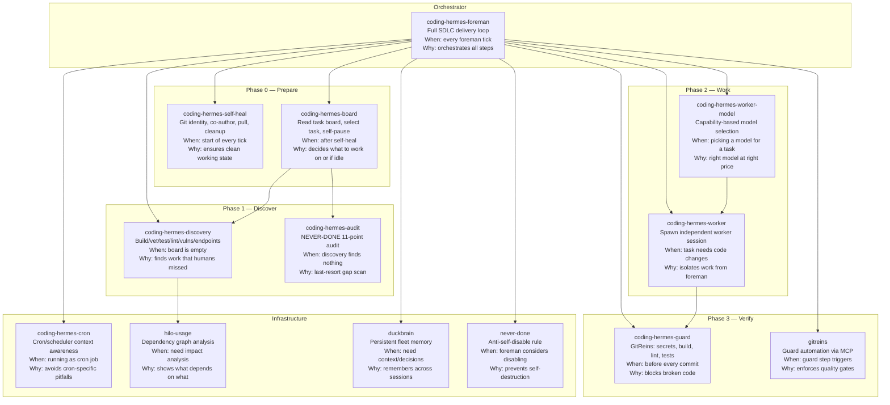

# Coding Hermes — Skill Map

Every coding-hermes skill includes this map. Load any one skill, get the full picture.



## When to Use Each Skill

| Skill | Load when... | Skip when... | Status |
|-------|-------------|-------------|--------|
| `coding-hermes-foreman` | Every foreman tick | — (always loaded) | PLANNED — not yet built; use `coding-hermes-cron` + this map instead |
| `coding-hermes-self-heal` | Start of every tick | — (always needed) | PLANNED — not yet built; run git status/log + hilo stats manually |
| `coding-hermes-board` | After self-heal, need task selection | — (always needed) | PLANNED — not yet built; read `.coding-hermes/tasks.md` directly |
| `coding-hermes-discovery` | Board is empty, need to find work | Board has actionable tasks | PLANNED — not yet built |
| `coding-hermes-audit` | Discovery finds nothing, last-resort scan | Discovery found tasks | PLANNED — embedded in NEVER-DONE tasks.md entry |
| `coding-hermes-worker-model` | Choosing a model for a new task | Mechanical/foreman-direct tasks | EXISTS |
| `coding-hermes-worker` | Need to spawn independent work session | Task is foreman-direct (specs, docs, mechanical) | EXISTS |
| `coding-hermes-guard` | Before every commit | — (always needed) | PLANNED — use GitReins MCP `guard_run` directly |
| `coding-hermes-cron` | Running as a cron/scheduler job | Interactive session | EXISTS — **also serves as foreman workflow reference when foreman skill is absent** |
| `hilo-usage` | Need dependency impact analysis | Simple tasks, single-file changes | EXISTS |
| `gitreins` | Guard step triggers | Guard already green | EXISTS |
| `duckbrain` | Need historical context, decisions, pitfalls | Fresh project, no history | EXISTS (as `mcp__duckbrain__*` tools) |
| `never-done` | Foreman considers disabling self | — (perpetual guard) | EXISTS |

> **Foreman workflow without `coding-hermes-foreman`:** Load `coding-hermes-cron` + this map. The cron skill's `references/foreman-tick-workflow.md` documents the concrete steps: self-heal → board read → audit/dispatch → board update → commit. This is the canonical fallback until the foreman skill is built.

## Task Routing by Type

| Task type | Model needed | Skills to load |
|-----------|-------------|----------------|
| Go code (complex) | Your most capable Go model (>your-provider) / Your best reasoning model (>your-provider) | worker-model, worker |
| Go code (mechanical) | Your fast budget model (>your-provider) | worker-model, worker |
| Python/TypeScript | Your Python/TypeScript model (>your-provider) / Your best reasoning model (>your-provider) | worker-model, worker |
| Shell/CLI | Your fast budget model (>your-provider) | worker-model, worker |
| Docs/Specs | Your fast budget model (>your-provider) | foreman-direct |
| Dependencies | Your fast budget model (>your-provider) | foreman-direct |
| Benchmarks | Your fast budget model (>your-provider) | worker-model, worker |
| Architecture design | Your best reasoning model (>your-provider) / Your architecture model (>your-provider) | worker-model, worker |

## Skill Size Budget

Skills MUST stay under 15KB. If a skill grows beyond this, split it into focused sub-skills and reference them. Smaller skills = faster loading = less token waste = cheaper ticks.

## Skill Health — YAML Frontmatter Corruption (2026-07-31)

**A skill with corrupted frontmatter silently disappears** — `skill_view` returns
`"unsupported on this platform"`, which LOOKS like a platform/readiness issue but
is actually a YAML parse failure. The `coding-hermes-foreman` skill was dead for
weeks this way; the scheduler foreman's fleet audit found 525 SKILL.md files, one
(coding-hermes-config) missing frontmatter entirely.

**#1 corruption shape:** a section-header line like
`references/ — Supporting documentation for foreman operations` injected INSIDE
the frontmatter (between the `---` delimiters) without a `- ` list prefix. The
YAML parser reads it as a nested mapping key and dies.

**When a skill reports "unsupported on this platform":** suspect frontmatter
corruption BEFORE suspecting the `platforms:` field. Verify:

```bash
python3 -c "
import yaml
parts = open('SKILL.md').read().split('---', 2)
fm = yaml.safe_load(parts[1])
print('YAML OK:', fm.get('name'))
"
```

**Fleet-wide audit (all local skills):**
```bash
for f in ~/.hermes/skills/*/SKILL.md ~/.hermes/skills/*/*/SKILL.md; do
  python3 -c "import yaml; parts=open('$f').read().split('---',2); yaml.safe_load(parts[1])" 2>/dev/null \
    || echo "BROKEN: $f"
done
```

**Fix:** remove the non-YAML lines from inside the frontmatter (restore proper
`- ` list syntax for reference entries). Re-verify with `yaml.safe_load` after.

## Reference Files

- **[coding-hermes-foreman → references/worker-dispatch-pitfalls.md](references/worker-dispatch-pitfalls.md)** — Foreman dispatch rules: interrupt-killed workers (exit 130 → partial uncommitted tree → re-dispatch with an appended NOTE), sequential dispatch for shared-file tasks, board DuckDB `depends_on` is VARCHAR[] (pass a list), interrupted `process wait` ≠ dead worker, verify-then-dispatch cadence.
- **[coding-hermes-foreman → references/duckbrain-embedding-store.md](references/duckbrain-embedding-store.md)** — DuckBrain semantic search architecture (DB-001 resolved 2026-08-02): gitignored `.embeddings/` content-addressed cache, model-agnostic providers, cache-assisted rebuild via git hooks, `duckbrain embeddings` CLI, recall query path, and pitfalls (CLI flag collisions, space-form args, detached-hook cwd).
- **[coding-hermes-foreman → references/sibling-sync-verification-stewardship.md](https://github.com/totalwindupflightsystems/reports)** — Stewardship tick pattern when a SIBLING landed sync/infra code and restarted the daemon between ticks: verify (don't re-implement) — evidence chain = daemon log spool-replay → status API duckbrain block → `sync_spool` empty (table is `sync_spool`, NOT `duckbrain_spool`, no `status` column) → MCP `/fleet/` keys present. HTTP :3000 read-path DUCKDB_CONNECTION_LOST while daemon writes succeed = lock contention, not a regression. Re-verify stale watch-task premises (INFRA-003 style) against live daemon cmdline + packer runningSet guard. Proven: scheduler tick #187 (2026-08-01).
- **[references/blackout-slowdown.md](references/blackout-slowdown.md)** — Peak-pricing cost control: blackout windows with cooldown multipliers for DeepSeek peak hours (01-04, 06-10 UTC). Configure in fleet.toml `[[scheduler.blackout_windows]]`.
- **[references/scheduler-api-pitfalls.md](references/scheduler-api-pitfalls.md)** — Real bugs discovered across 150+ foreman ticks: cooldown silent-failure (camelCase vs snake_case), reversion patterns, autoSlowdown scanner bug. Read this before claiming any scheduler API fix worked.
- **[references/client-catalog-upload.md](references/client-catalog-upload.md)** — Pattern for receiving client vendor catalogs: quick Python HTTP upload server, cloudflared tunnel, permanent project storage (never /tmp), PDF text extraction with pdftotext fallback, real-world catalog challenges (image-heavy design catalogs, multi-language specs, large PDF handling).
- **[references/project-onboarding.md](references/project-onboarding.md)** — Greenfield project onboarding recipe: scaffold → DuckDB board init → GitReins install → scheduler registration at 900s fast cooldown → dual task stores (board + .gitreins) → worker-spawn smoke tests.
- **[scripts/upload-server.py](scripts/upload-server.py)** — Reusable single-file Python HTTP upload server with progress bar, multiple file support, dark-themed UI, and configurable port + upload directory.
